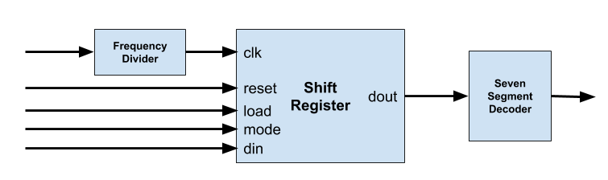

# Lab 06 Assignments

## Grading Sources

* Design frequency divider (*freq_div.vhd*).

* Design 4 bit Shift Register (*shift_reg.vhd*).

* Design 7 Segment Decoder that gets 4-bit input and generate 7-bit common cathode output (*seven_segment.vhd*).

* complete  testbench file that design is like **`testbench.png`** for validate the correctness of modules (*tb_module.vhd*).

## Submission Sources
* **Source files (Grading Sources)**
* **Waveform of testbeches that covers all signals in `testbench.png` diagram**

